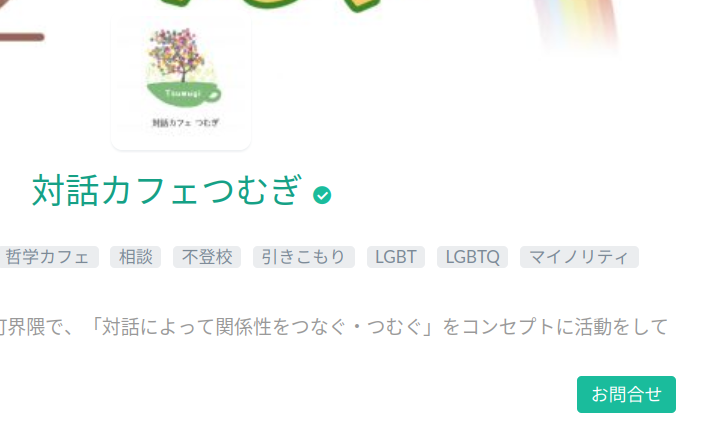

https://twitter.com/taiwatsumugi

主催: [山下真実]()、加賀ななえ

↓LGBTQにはPZNが含まれるんでしたっけ...?

https://archive.md/RSizN

<blockquote class="twitter-tweet">
埼玉県富士見市議会の加賀奈々恵議員が一般質問で、トランスジェンダーをめぐり「どれほどの違和感や苦しみを持っていたとしても『性別』は変えられない」などと発言しました。性自認の尊重を否定する発言です。3月24日 08:24まで全文お読みいただけます。 <a href="https://t.co/w1oEkObqkS">https://t.co/w1oEkObqkS</a>
&mdash; 朝日新聞 ThinkGender (@asahi_gender) <a href="https://twitter.com/asahi_gender/status/1771318753051234573?ref_src=twsrc%5Etfw">March 22, 2024</a></blockquote>  

<blockquote class="twitter-tweet">
「多くの人々はジェンダーアイデンティティが何かも分からないまま「心の性」があるといった考えを鵜呑みにし、多くの子どもたちが、自分は誤った性別に生まれついたと錯覚し、取り返しのつかない治療を受けて〜」  トランスジェンダーの存在自体を認めない、酷いヘイトスピーチだと思います。 <a href="https://t.co/RnveM9pVgx">https://t.co/RnveM9pVgx</a>
&mdash; ひいらぎ (@nebukaiwala) <a href="https://twitter.com/nebukaiwala/status/1667522091644755970?ref_src=twsrc%5Etfw">June 10, 2023</a></blockquote>  

<blockquote class="twitter-tweet">
<a href="https://twitter.com/hashtag/LetWomenSpeak?src=hash&amp;ref_src=twsrc%5Etfw">#LetWomenSpeak</a> Japan is explicitly anti-LGBT and not just anti-trans  The international branches don&#39;t ever seem to understand how pretending to be feminist and pro gay is an important part of GC propaganda lol <a href="https://t.co/R5AAjxr2Mc">https://t.co/R5AAjxr2Mc</a>
&mdash; Katy Montgomerie 🦗 (@KatyMontgomerie) <a href="https://twitter.com/KatyMontgomerie/status/1664585068776415233?ref_src=twsrc%5Etfw">June 2, 2023</a></blockquote>  

<blockquote class="twitter-tweet">
理解増進にすら反対のゴリゴリのホモフォビアが「対話カフェつむぎ」のスタッフとかやばすぎるでしょ。 <a href="https://t.co/tzuyJ0sgKe">pic.twitter.com/tzuyJ0sgKe</a>
&mdash; bearscampに行きたいなおすけ (@nyaa_naosuke_su) <a href="https://twitter.com/nyaa_naosuke_su/status/1659759215953543169?ref_src=twsrc%5Etfw">May 20, 2023</a></blockquote>  

<blockquote class="twitter-tweet">
国会前デモに参加しました。 これまで多くの女性が匿名で絶えることなく声を上げ続けてきました。  今回 、LGBT法案の廃案を求め、一人一人が強い意志を持って立ち上がり「女性として反対の声を上げる集会」をはじめて行いました。<a href="https://twitter.com/hashtag/LGBT%E6%B3%95%E6%A1%88%E3%81%AE%E5%BB%83%E6%A1%88%E3%82%92%E6%B1%82%E3%82%81%E3%81%BE%E3%81%99?src=hash&amp;ref_src=twsrc%5Etfw">#LGBT法案の廃案を求めます</a><a href="https://twitter.com/hashtag/LetWomenSpeak?src=hash&amp;ref_src=twsrc%5Etfw">#LetWomenSpeak</a> <a href="https://twitter.com/hashtag/WomenSayNo?src=hash&amp;ref_src=twsrc%5Etfw">#WomenSayNo</a> <a href="https://t.co/qUK8HdeQQ0">pic.twitter.com/qUK8HdeQQ0</a>
&mdash; 加賀ななえ(富士見市議会議員) (@Nanaekaga) <a href="https://twitter.com/Nanaekaga/status/1662403458211917825?ref_src=twsrc%5Etfw">May 27, 2023</a></blockquote>  

<blockquote class="twitter-tweet">
ネオナチと一緒に抗議活動をやったKJKにコメントを送る加賀ななえ <a href="https://t.co/YQoBhI28vH">pic.twitter.com/YQoBhI28vH</a>
&mdash; ネオバターなおすけ (@nyaa_naosuke_su) <a href="https://twitter.com/nyaa_naosuke_su/status/1670295483703787520?ref_src=twsrc%5Etfw">June 18, 2023</a></blockquote>  

<blockquote class="twitter-tweet">
これはひどい😔 加賀ななえ市議は出版元とめっちゃ仲良し､､､ <a href="https://t.co/RyQulGuVVc">https://t.co/RyQulGuVVc</a> <a href="https://t.co/UIvTo8op7w">pic.twitter.com/UIvTo8op7w</a>
&mdash; 白江好友(ともスケ) (@ys48698064) <a href="https://twitter.com/ys48698064/status/1672118700084953088?ref_src=twsrc%5Etfw">June 23, 2023</a></blockquote>  

<blockquote class="twitter-tweet">
何人ものゲイが、そうやって女性につい偉そうに語り、嫌がらせをし続けているのが、今の日本です。  男性の中でも、ゲイの方のミソジニー(女性蔑視)は特に激しいように思います。このツイートに反応する瞬発力でまたそれが証明されるかもしれません。  もちろん私も男性で、自省を続けるばかりですが。 <a href="https://t.co/6AhEvHfnCR">https://t.co/6AhEvHfnCR</a>
&mdash; まことさん🪢山下真実 (@plmakoto) <a href="https://twitter.com/plmakoto/status/1672193678541221888?ref_src=twsrc%5Etfw">June 23, 2023</a></blockquote>  

